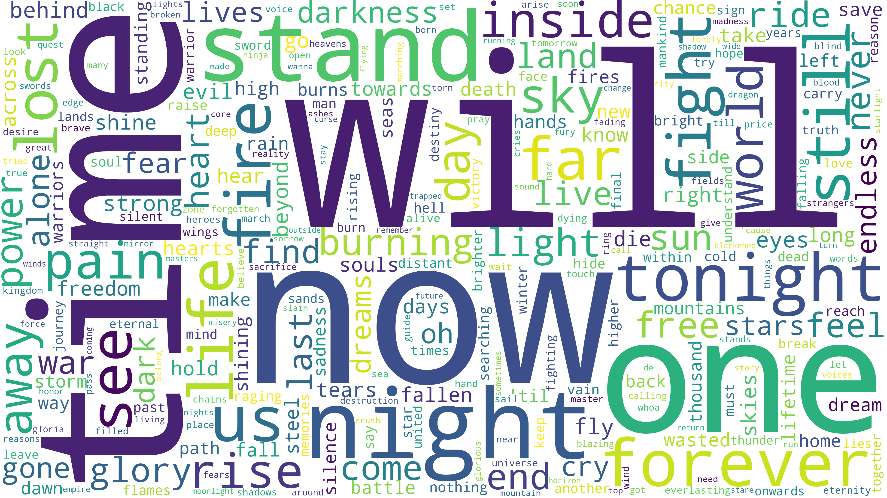

# lyric-analysis

<h1 align="center">
  
  <br/>
  <br/>
  Small project to analyze the word make-up of all songs of a given artist.
</h1>

<p align="center">
  <a href="https://opensource.org/licenses/MIT">
    
  </a>
  <a href="https://github.com/DeveloperPaul123/MHWDatabase/stargazers">
    
  </a>
  <a href="https://discord.gg/yNQ9dW4">
    
  </a>
</p>

## Getting Started

### Project Setup

A proxy is required to download music lyrics. Check [here](https://free-proxy-list.net/?__cf_chl_captcha_tk__=29a7b1055a1e87a49f4bc74bf2e83b2841abd3ad-1592944263-0-ASKfAWw60zRfsMxZP615tkHb2wHn9r3DQqGAZ8l93UfOMOSfg0ic4BQT2CjwnNKQV25Jk4LRCt4JnsO5NoJJTyjO4Tw4E8_L-GV_VKI9BVYa2c6KrgbOLE_jBEST_vn6EPceMoNROW_KNbuQ4MzBbUWeYVuomCmhVcM_ohZ6jmC7I7DORKckSSnRN-zEWspUK9nrzDQf_qLqcRvkIbKifENwd_RAhdADw7scaml0x6_3WIjt_qgx19SCiAD7mDiIG2ca-Jp5OYLBk6xnop7K2rdiBscSs5iAARjaKQFaGfk-CN44lP1j_4oYULBs3ZpShdMCq5pA39gpdH4EqQXe9quALLC3M3SRylFeks0oyyaL17GcIv28zWtgrzSgiumVubE_paLlZUQ8r0sKidoHIypDSx3ZdwXlszgWOkVIhSYfdThqAP0W8LQANYa85wKAwUymqZQjDxV1RVNZfxVcViEvlbFPkviqzchYPiK2d9A_pQZ5qe0bYJ_U3_MjLthBjg) for a list of free proxies.

### Getting Lyrics

Once your proxy is set up, you'll need change the proxy IP address and port in `lyric-download.py`. Once you've done that and set up the proxy on your local machine, you can run the `lyric-downloader.py` script to download lyrics:

```python
& python.exe lyric-downloader.py -a <artist-name>
```

You may need to run this script multiple times to download all the lyric files. Each song will be saved to it's own `*.txt` file.

### Analyze Lyrics

To analyze the downloaded lyric files, run the `lyric-analysis.py` script:

```python
& python.exe lyric-analysis.py -a <artist-name>
```

Note that the `<artist-name>` must match the artist name in the `*.txt` files that were saved by `lyric-downloader`

The analysis will create 3 files:

- A bar plot of the top 40 words
- A word cloud of the top 300 words
- A `csv` file of all the found words and their count across all the lyric files.

## Author

| [<br><sub>@DeveloperPaul123</sub>](https://github.com/DeveloperPaul123) |
|:----:|

### Issues

Found a :bug:? File an [issue](https://github.com/DeveloperPaul123/lyric-analysis/issues), just be sure there isn't one already open that address the issue you found. Have an idea? Feel free to file an issue documenting what you'd like to see. The more detail the better!

## License

All the code available under the MIT license. See [LICENSE](LICENSE).
